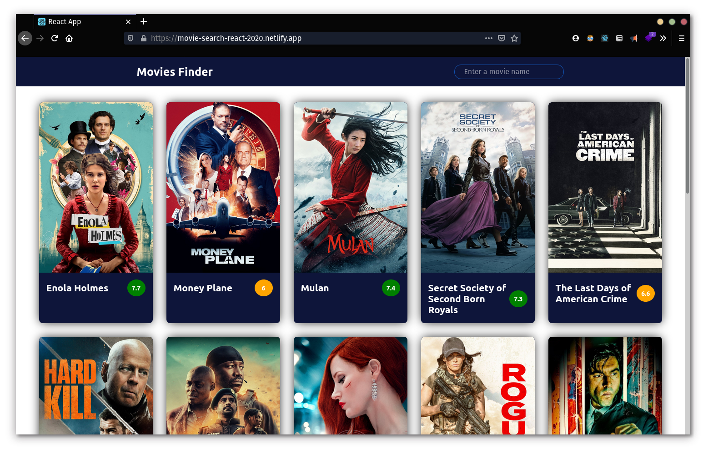

# React Movie Search App

## [🔗 Check the live site here](https://movie-search-react-2020.netlify.app/)

This is a Movie library app where you can search for any movies. This App is created with React and for state management I have used React hooks.
I used [TMDB Api](https://themoviedb.org) for getting all the movies.

Main Features:

-   View Featured movies on the first page
-   Search for a Movie
-   React Hooks for state management
-   Working with TMDB API

Screenshots:

This project was bootstrapped with [Create React App](https://github.com/facebook/create-react-app).

## Available Scripts

In the project directory, you can run:

### `npm start`

Runs the app in the development mode. 
Open [http://localhost:3000](http://localhost:3000) to view it in the browser.

